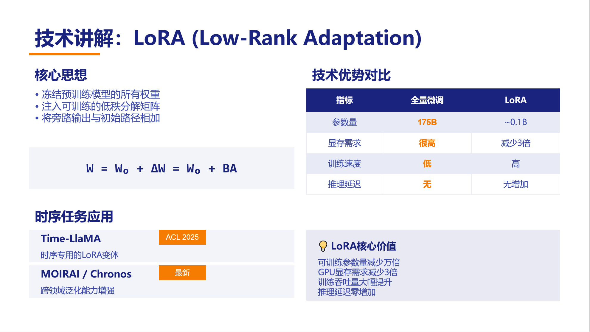
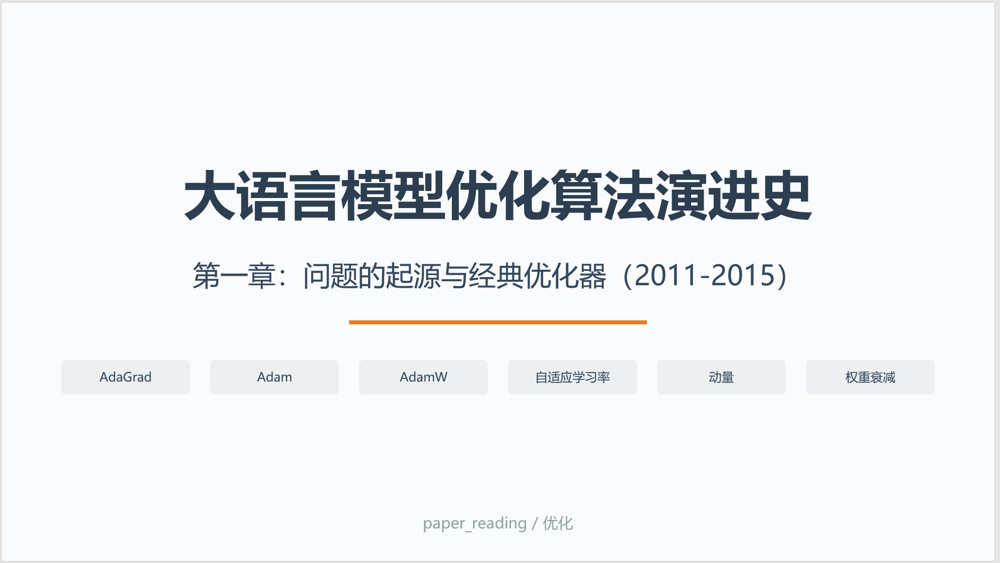

# **PPT-MASTER** ⭐

> **专业 PPT 设计制作 AI 技能** — 融合设计原理与代码生成，让大模型真正帮你做出专业的 PPT。

> [!NOTE]
> 本技能脱胎于 [MiniMax pptx-generator](https://github.com/MiniMax-AI/skills/tree/main/skills/pptx-generator)，经由大量设计文献的理论注入与实战优化，形成了一套完整的方法论。

---

## 🔥 它能做什么

当你对大模型说"帮我做个 PPT"，传统做法是大模型生成一堆文字内容，然后你自己去排版。

**ppt-master 不一样**：它会先问你一堆问题搞清需求，然后直接生成可编译的代码，输出完整的 `.pptx` 文件。整个过程有设计原理支撑，不是"内容+排版"割裂的两步走。

---

## ⚡ 核心能力

| 能力 | 说明 |
|:---|:---|
| **需求分析** | 先搞清谁看、在哪看、几分钟、什么风格 — 需求不清不做 |
| **设计决策** | Q1-Q9 清单 + CRAP 四原则自问 — 不是拍脑袋 |
| **代码生成** | PptxGenJS 代码 — 直接输出 .pptx，不是文字内容 |
| **场景化方案** | 学术/商业/培训/工作汇报 — 各有专门的配色字体版式 |
| **组件库复用** | 预建 18 个模板 + 4 种布局 + 5 套主题 — 不用从头写 |

---

## 📚 设计理论支撑

本技能不是"经验之谈"，而是深度学习了 **14 本**经典设计文献后提炼而成：

| 本技能模块 | 来源文献 |
|:---|:---|
| **CRAP 四原则** | Robin Williams《写给大家看的设计书》 |
| **配色 7:2:1 法则** | Garr Reynolds《演说之禅》+ Ellen Lupton《Thinking with Type》 |
| **字体决策矩阵** | Ellen Lupton《Thinking with Type》 |
| **大师灵感策略** | 《The Graphic Design Idea Book》50 位大师 |
| **三维体系** | 孙小小《PPT演示之道》+ 杨臻《PPT要你好看》 |
| **Q1-Q9 决策框架** | 融合 Kano 模型 + 设计思维方法论 |
| **场景化信息密度** | 各场景指南综合提炼 |

> [!TIP]
> 14 本参考文献：《PPT演示之道》《PPT要你好看》《写给大家看的PPT设计书》《成为PPT高手》《改变思维》《PPT设计从入门到精通》《PPT之光》《PPT设计原理》《演说之禅》《演说之禅设计篇》《The Non-Designer's Design Book》《Design Book for Non-Designers》《The Graphic Design Idea Book》《Thinking with Type》

---

## 🎯 效果展示

使用本技能生成的《LLM优化算法演进史》第一章课件（21页）：

| 封面 | 目录 | 内容页 | 结尾页 |
|:---:|:---:|:---:|:---:|
|  |  |  |  |

---

## 🔄 工作流程


---

## 📂 目录结构

```
ppt-master/
├── ppt-master/                # 技能代码
│   ├── SKILL.md              # 技能定义（主入口）
│   ├── assets/               # PptxGenJS 代码模板
│   │   ├── compile*.js       # 编译脚本（支持 --watch 监听模式）
│   │   ├── slide-*.js        # 18 个预建幻灯片模板
│   │   └── chart-*.js        # 图表模板
│   ├── components/            # 组件库
│   │   ├── layouts/          # 布局组件（threeColumn/comparison/timeline/cardGrid）
│   │   ├── blocks/           # 内容块（formulaBox/keywordTag/highlightBox/dataTable）
│   │   └── theme/            # 主题配色（academic/business/minimal/tech/warm）
│   └── references/           # 参考文档（22个）
│       ├── design-principles.md    # CRAP四原则
│       ├── color-system.md        # 配色系统（18套行业配色）
│       ├── typography-guide.md     # 字体选择指南
│       ├── master-inspiration.md  # 50位设计大师灵感
│       ├── three-dimensions.md    # 三维体系
│       ├── scenarios/             # 4种场景指南
│       ├── cases/                # 案例库（苹果/华为/TED/失败案例）
│       └── [其他]                # 质量检查/常见错误/图表设计等
├── 效果展示/                  # 效果截图
└── README.md                  # 本文件
```

---

## 🚀 快速开始

放到 AI IDE 的 `/.skill/` 文件夹下，例如 **Trae**、**Cursor**、**openclaw** 也可以使用，就可以调用本技能，描述你的 PPT 需求即可。技能会自动引导你完成需求分析，然后生成代码。

---

## 💼 适用场景

| 场景 | 推荐等级 | 特点 |
|:---|:---:|:---|
| 学术汇报 / 论文答辩 | 二等 | 信息密度高，逻辑严谨，配色稳重 |
| 产品发布 / 路演 | 一等 | 极简、一页一信息、视觉冲击力 |
| 培训课件 | 二等 | 结构清晰，重点突出，便于学员理解 |
| 工作汇报 / 述职 | 二等 | 结论先行，数据支撑，专业高效 |
| 商业计划 / BP | 一等~二等 | 说服力强，逻辑清晰，视觉专业 |

---

## 🛠 技术栈

- **代码生成** → PptxGenJS
- **技能格式** → Skill (.md)
- **设计理论** → CRAP / 配色心理学 / 认知科学

---

## 🙏 致谢

- 原始技能：[MiniMax pptx-generator](https://github.com/MiniMax-AI/skills/tree/main/skills/pptx-generator)
- 设计理论：《通用设计法则》《写给大家看的设计书》《Thinking with Type》《The Graphic Design Idea Book》等

---

## 📄 License

MIT
